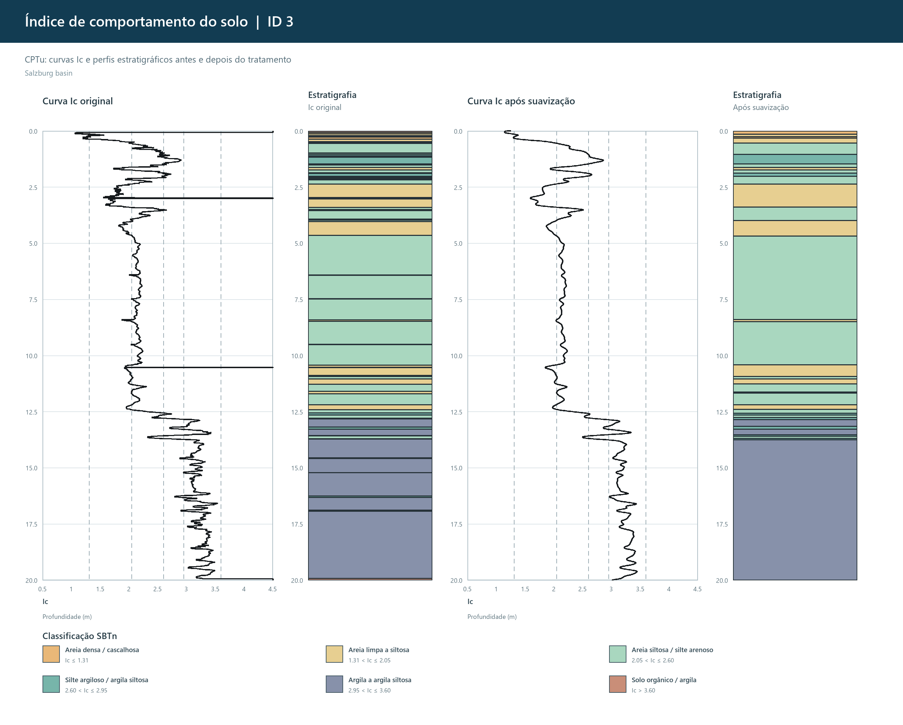

# CPTu Soil Behaviour Analysis

[](https://www.python.org/)
[](tests)
[](LICENSE)

A reproducible Python workflow for CPTu/SCPTu processing, normalized soil behaviour type classification (SBTn), Gaussian smoothing sensitivity and stratigraphic diagnostics.

The project was developed as a geotechnical engineering portfolio study. It validates the calculated soil behaviour index against the published Premstaller dataset and explicitly measures the interpretive cost of smoothing.



## Engineering question

CPTu signals contain both short-wavelength measurement variability and potentially real thin layers. Rather than presenting one visually smooth curve as ground truth, this workflow:

1. calculates corrected and normalized CPTu parameters with explicit units;
2. validates calculated `Ic` against values published by the dataset authors;
3. compares Gaussian scales of 0.05, 0.12 and 0.25 m;
4. reports class changes, variability reduction, transitions and layer counts;
5. keeps raw and smoothed interpretations visible side by side.

## Key equations

With `qc` and `qt` in MPa and `u2`, `fs` and stresses in kPa:

```text
qt   = qc + (1 - a) u2 / 1000
qnet = 1000 qt - σv
Fr   = 100 fs / qnet
Qtn  = (qnet / Pa) (Pa / σ'v)^n
Ic   = √[(3.47 - log10 Qtn)² + (log10 Fr + 1.22)²]
n    = min[1, 0.381 Ic + 0.05 (σ'v / Pa) - 0.15]
Pa   = 100 kPa
```

`n` and `Ic` are solved iteratively. Invalid stress states are reported as missing values rather than hidden through numerical clipping. See [the methodology](docs/methodology.md) for assumptions and limitations.

## Previous ten-profile assessment

The validated reference run produced:

| Indicator | Result |
|---|---:|
| Mean MAE, calculated vs published `Ic` | 0.0063 |
| Mean RMSE, calculated vs published `Ic` | 0.0202 |
| Variability reduction at σ = 0.05 m | 72.7% |
| Points changing SBTn class at σ = 0.05 m | 6.9% |
| Mean transitions, before → after | 84.8 → 43.7 |
| Layers ≥ 0.10 m not preserved | 3 of 399 |

These figures support 0.05 m as the conservative default for this dataset, not as a universal CPTu smoothing parameter.

## Installation

```bash
git clone https://github.com/Walter-Ricci/cptu-soil-behavior-analysis.git
cd cptu-soil-behavior-analysis
python -m venv .venv
```

Activate the environment and install:

```bash
python -m pip install -e ".[dev]"
```

## Dataset

Download `mmc1.csv` from the dataset associated with [Oberhollenzer et al. (2021)](https://doi.org/10.1016/j.dib.2020.106618). The 345 MB source file is deliberately excluded from Git. Further attribution and licensing notes are in [`data/README.md`](data/README.md).

## Run

```bash
cptu-analyze --input "/path/to/mmc1.csv" --output results/generated
```

Only the first ten CPTu/SCPTu profiles in source order are processed by default. To run one profile:

```bash
cptu-analyze --input "/path/to/mmc1.csv" --id 3
```

The selected output directory is cleared before a new run unless `--keep-output` is passed. The raw input is never modified.

## Tests

```bash
pytest -q
```

Tests cover unit conversion in `qt`, iterative `Qtn/Fr/Ic`, classification boundaries, Gaussian symmetry, invalid stress states, layer thickness and input preparation.

## Repository structure

```text
src/cptu_analysis/   numerical methods, I/O, analysis, plots and CLI
scripts/             source-checkout convenience runner
tests/               automated unit tests
docs/                equations, assumptions and limitations
data/                download and attribution instructions only
results/             curated figures and reference metrics
```

## Interpretation limits

SBTn is a soil-behaviour classification, not a direct grain-size description. A smoother can suppress both noise and real thin layers. Any consolidation of short layers should therefore be reviewed against sampling interval, `u2` response, boreholes and laboratory data before design use.

## Licence

Original software is released under the [MIT License](LICENSE). The external dataset remains subject to its own CC BY 4.0 terms and is not covered by the software licence.
